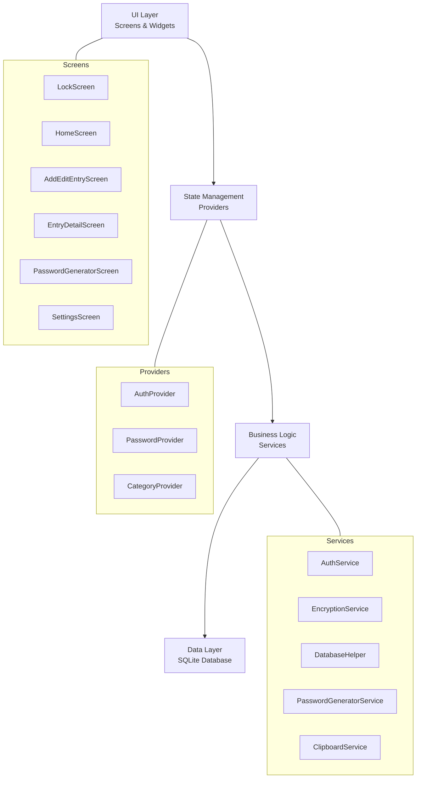
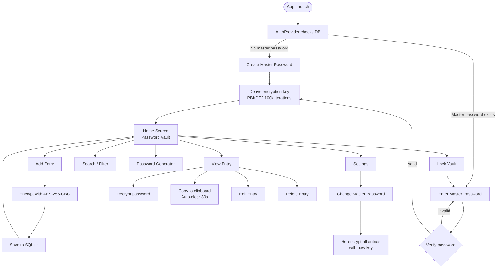
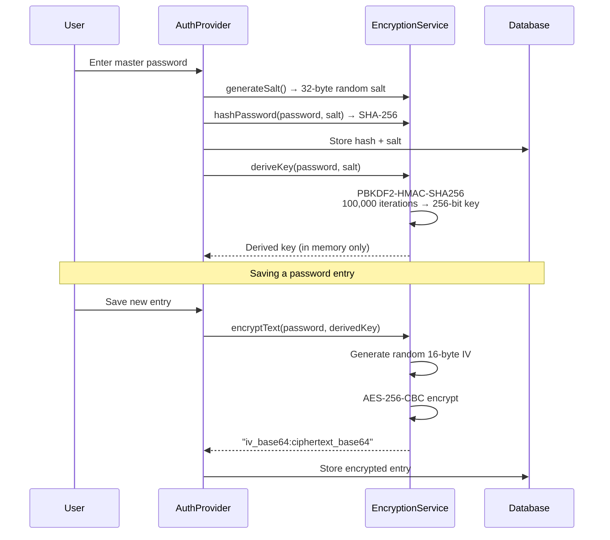
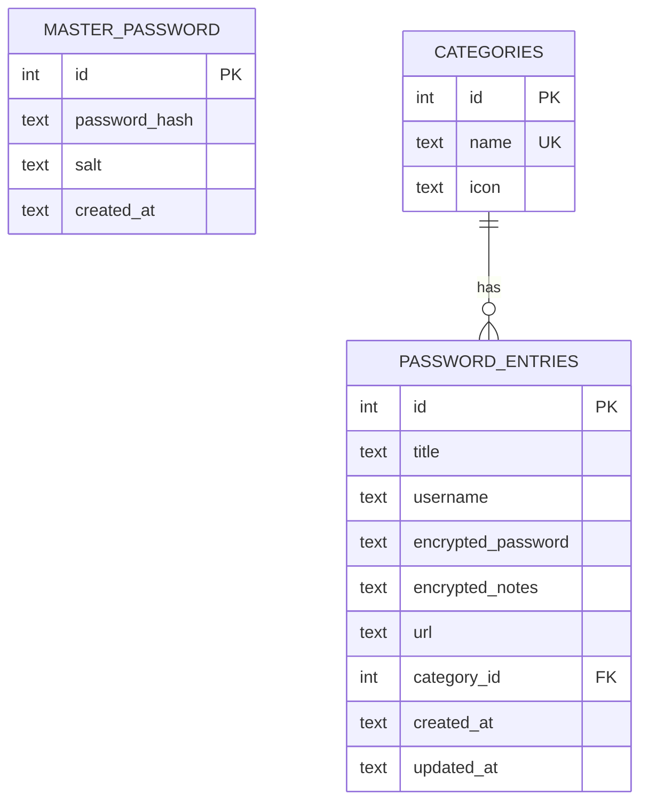

[](https://flutter.dev)
[](https://dart.dev)
[](LICENSE)
[]()
[]()

# Flutter Password Manager

A secure, cross-platform password manager built with Flutter. Protects your credentials with AES-256-CBC encryption and PBKDF2 key derivation, all stored locally on your device.

## Features

| Feature | Description |
|---|---|
| **Master Password** | Single master password to unlock your vault with SHA-256 hashing |
| **AES-256 Encryption** | All passwords and notes encrypted with AES-256-CBC |
| **PBKDF2 Key Derivation** | 100,000 iteration PBKDF2-HMAC-SHA256 key stretching |
| **Password Generator** | Configurable generator (4-64 chars) with strength indicator |
| **Categories** | 7 default categories with custom icon mapping |
| **Search & Filter** | Real-time search across title, username, and URL |
| **Auto-Lock** | Vault locks automatically when app goes to background |
| **Clipboard Security** | Auto-clears clipboard after 30 seconds |
| **Cross-Platform** | Runs on Android, iOS, Web, Linux, macOS, and Windows |

## Architecture



## App Flow



## Encryption Flow



## Project Structure

```
lib/
├── main.dart                  # App entry point, web DB factory setup
├── app.dart                   # MaterialApp with theme and routing
├── models/
│   ├── master_password.dart   # Master password model
│   ├── password_entry.dart    # Password entry model
│   └── category.dart          # Category model
├── providers/
│   ├── auth_provider.dart     # Authentication state management
│   ├── password_provider.dart # Password vault state management
│   └── category_provider.dart # Category state management
├── screens/
│   ├── lock_screen.dart       # Master password setup / unlock
│   ├── home_screen.dart       # Main vault with search and filters
│   ├── add_edit_entry_screen.dart  # Create / edit password entry
│   ├── entry_detail_screen.dart    # View entry details
│   ├── password_generator_screen.dart  # Password generator tool
│   └── settings_screen.dart   # App settings and master password change
├── services/
│   ├── auth_service.dart      # Authentication logic
│   ├── encryption_service.dart # AES-256 + PBKDF2 cryptography
│   ├── database_helper.dart   # SQLite database operations
│   ├── password_generator_service.dart # Password generation + strength
│   └── clipboard_service.dart # Secure clipboard with auto-clear
├── widgets/
│   ├── password_field.dart    # Password input with visibility toggle
│   ├── password_strength_indicator.dart # Visual strength bar
│   ├── entry_list_tile.dart   # Password entry list item
│   ├── category_chip.dart     # Category filter chip
│   └── confirm_dialog.dart    # Reusable confirmation dialog
└── utils/
    ├── constants.dart         # App-wide constants and defaults
    └── icon_mapper.dart       # String-to-IconData mapping
```

## Tech Stack

| Layer | Technology | Purpose |
|---|---|---|
| Framework | Flutter 3.6+ | Cross-platform UI |
| Language | Dart 3.6+ | Application logic |
| State Management | `provider` | Reactive ChangeNotifier-based state |
| Database | `sqflite` | Local SQLite storage |
| Database (Web) | `sqflite_common_ffi_web` | SQLite via WASM for web |
| Encryption | `encrypt` | AES-256-CBC encryption/decryption |
| Hashing | `crypto` | SHA-256 and HMAC-SHA256 |
| Date Formatting | `intl` | Localized date/time display |

## Database Schema



## Default Categories

| Category | Icon |
|---|---|
| Social Media | `people` |
| Email | `email` |
| Finance | `account_balance` |
| Shopping | `shopping_cart` |
| Work | `work` |
| Entertainment | `movie` |
| Other | `folder` |

## Getting Started

### Prerequisites

- Flutter SDK 3.6 or higher
- Dart SDK 3.6 or higher

### Installation

```bash
# Clone the repository
git clone https://github.com/ridwanspace/flutter-password-manager.git
cd flutter-password-manager

# Install dependencies
flutter pub get
```

### Running

```bash
# Android / iOS
flutter run

# Web (requires WASM setup)
dart run sqflite_common_ffi_web:setup
flutter run -d chrome

# Linux / macOS / Windows
flutter run -d linux
```

## Security Overview

| Mechanism | Details |
|---|---|
| Password Hashing | SHA-256 with unique random salt per user |
| Key Derivation | PBKDF2-HMAC-SHA256, 100,000 iterations |
| Data Encryption | AES-256-CBC with random IV per entry |
| Salt | 32-byte cryptographically secure random |
| Key Storage | Derived key held in memory only, never persisted |
| Clipboard | Auto-cleared after 30 seconds |
| Auto-Lock | Vault locks on app background/detach |
